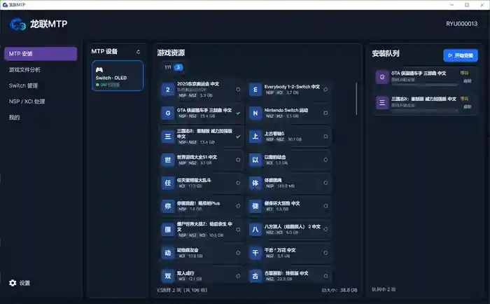
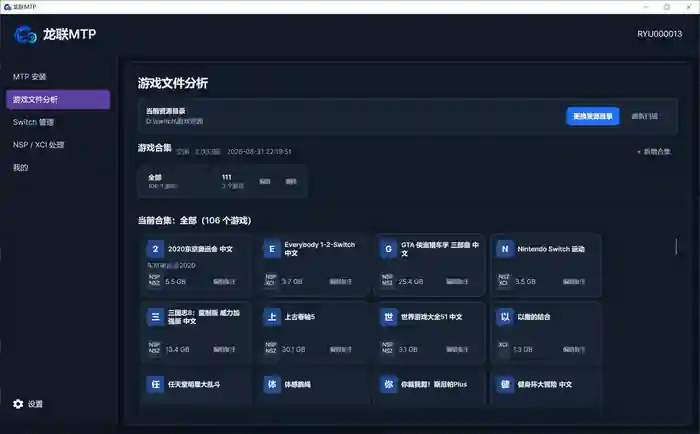

# RyuLink MTP

[简体中文](README.md) | **English**

**RyuLink MTP** is a **Windows-only** desktop manager for Nintendo Switch. It focuses on managing local game packages through **DBI MTP**, viewing Switch storage information, maintaining installation queues, and processing NSP/XCI packages.

> Currently supported on Windows only. The project is still under active development, and some features are not yet available or still need further stabilization.

## Screenshots

### MTP Installation

### Game Library

## Features

### Game Library

- Select and scan local game directories.
- Detect `.nsp`, `.nsz`, `.xci`, and `.xcz` files.
- Rescan or cancel an active scan.
- Display scan progress, errors, and warnings.

### Collections

- Includes a built-in **All** collection.
- Create, edit, and delete custom collections.
- Add the same game to multiple collections.
- Add and edit notes for individual games.

### MTP Installation

- Detect a connected Nintendo Switch running **DBI MTP**.
- Read available SD card and NAND storage space.
- Add a single game or an entire collection to the installation queue.
- View installation progress and task status.
- Retry failed tasks or remove tasks from the queue.
- Validate device connectivity, free space, source files, and installation results before and during installation.
- Lock other MTP operations while installing to avoid concurrent device access.

### Installation Queue

- Persist installation tasks locally.
- Restore unfinished task states after restarting the application.
- Manage queued, installing, failed, and completed tasks in one place.

### NSP / XCI Processing

- Select a folder containing a base game, updates, and DLC.
- Automatically collect supported package files.
- Merge and output packages as **NSP** or **XCI**.
- Display processing progress and logs.

### Switch Overview

When a device is connected, RyuLink MTP can display:

- Switch model / serial number
- System firmware version
- SD card capacity and usage
- NAND capacity and usage
- DBI MTP connection status

### Settings & About

- View the current application version.
- Additional settings are still under development.

## Current Status & Limitations

- **Windows only.** Real Windows MTP / DBI device access is currently enabled only on Windows.
- Code for listing installed games and uninstalling them already exists, but the UI is temporarily hidden because of Windows MTP COM / RCW stability issues.
- Game package parsing and NSP/XCI processing depend on the bundled Python `game-core` worker. If the Python environment is not configured correctly, the application will prompt the user to install or configure it.
- The project is still evolving, so features and UI may change over time.

## Getting Started

1. Start DBI with MTP support on your Nintendo Switch.
2. Connect the Switch to your Windows PC via USB.
3. Launch RyuLink MTP and wait for the device to be detected.
4. Add a local game directory and scan it.
5. Select games or collections and add them to the installation queue.
6. Check available Switch storage space and start the installation.

## Project Goal

RyuLink MTP is designed to simplify local resource management and DBI MTP workflows between Windows and Nintendo Switch by bringing game scanning, collections, installation queues, device information, and NSP/XCI processing into one desktop application.

> Only process content you are authorized to use, and comply with applicable local laws as well as relevant software and content license terms.
